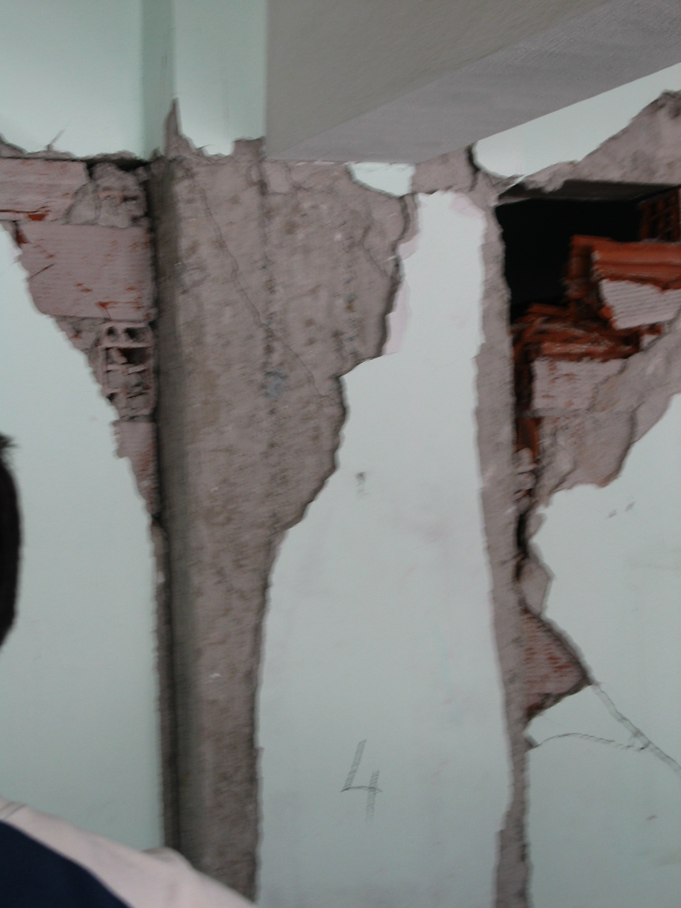

內文提供:邱瑞彬
# 柱相關照片之分類、裁切說明及拍攝建議
- [柱相關照片之分類、裁切說明及拍攝建議](#柱相關照片之分類裁切說明及拍攝建議)
  - [1.資料來源](#1資料來源)
    - [1.1. 資料內地震事件及對應數量](#11-資料內地震事件及對應數量)
  - [2. 柱分級方式](#2-柱分級方式)
    - [2.1 營建署柱分級示意](#21-營建署柱分級示意)
  - [3.柱照片篩選方式](#3柱照片篩選方式)
    - [3.1. 照片圖例](#31-照片圖例)
      - [3.1.1 模糊清楚之照片示意](#311-模糊清楚之照片示意)
      - [3.1.2 過於局部之照片示意](#312-過於局部之照片示意)
  - [4. 裁切方式說明](#4-裁切方式說明)
    - [4.1. 裁切要求](#41-裁切要求)
    - [4.2. 裁切圖例](#42-裁切圖例)
      - [4.2.1. 柱於畫面中佔比不高的情況](#421-柱於畫面中佔比不高的情況)
      - [4.2.2. 遇到畫面雜物繁多的情況](#422-遇到畫面雜物繁多的情況)
      - [4.2.3. 遇到畫面有多根柱的情況](#423-遇到畫面有多根柱的情況)
      - [4.3. 處理後之柱照片數量](#43-處理後之柱照片數量)
  - [5. 拍攝建議](#5-拍攝建議)

## 1.資料來源

資料來源: datacenterhub，網址為https://datacenterhub.org/deedsdv/publications/view/454

### 1.1. 資料內地震事件及對應數量

| 地震種類 | Duzce 1999 | Bingol 2003 | Peru 2007 |Wenchuan 2008| Haiti 2010 |總數|
|  :----:  |    :---:   |    :---:    |   :---:   |    :---:   |    :---:    |:---:|
| 建築數量 |  90        |    57       |    26     |      2      |     153      |328|
| 照片數量 |  647       |    1963     |    500    |      8      |     3635     |6753|

## 2. 柱分級方式
將柱照片依照損傷，參照營建署定義的等級，分到L1，L2，L3，L4和L5的資料夾。

### 2.1 營建署柱分級示意

## 3.柱照片篩選方式
對於**模糊不清楚，過於局部**的照片都**不使用**。

### 3.1. 照片圖例
#### 3.1.1 模糊清楚之照片示意

#### 3.1.2 過於局部之照片示意

**以上照片均不使用於模型訓練。**

## 4. 裁切方式說明

首先確認柱在照片具體位置，藉由裁切使柱位於照片正中心，並且盡量降低其他雜物對於畫面的影響。

### 4.1. 裁切要求

- 使柱位於照片**中心**。

- 拍攝時與柱保持一定距離，盡可能涵蓋**柱頂**和**柱底**。

- 盡量讓柱佔整張圖片的**50%以上**。

- 去掉背景雜訊，避免將其他雜物涵蓋進去。

### 4.2. 裁切圖例

#### 4.2.1. 柱於畫面中佔比不高的情況

#### 4.2.2. 遇到畫面雜物繁多的情況

#### 4.2.3. 遇到畫面有多根柱的情況

#### 4.3. 處理後之柱照片數量
|震損分級|柱照片數量|
|---|---|
|L1|185|
|L2|292|
|L3|253|
|L4|202|
|L5|368|
|總數|1300|

## 5. 拍攝建議
根據專業建議，柱拍攝要點如下：

- **確保柱子居中**：拍攝時要讓柱位於畫面中心。
- **涵蓋頂底**：照片最好能包含柱子的頂部與底部。
- **柱子占比**：柱應佔照片50%以上。
- **避免雜物**：減少背景中干擾元素，將焦距對準柱本身。
